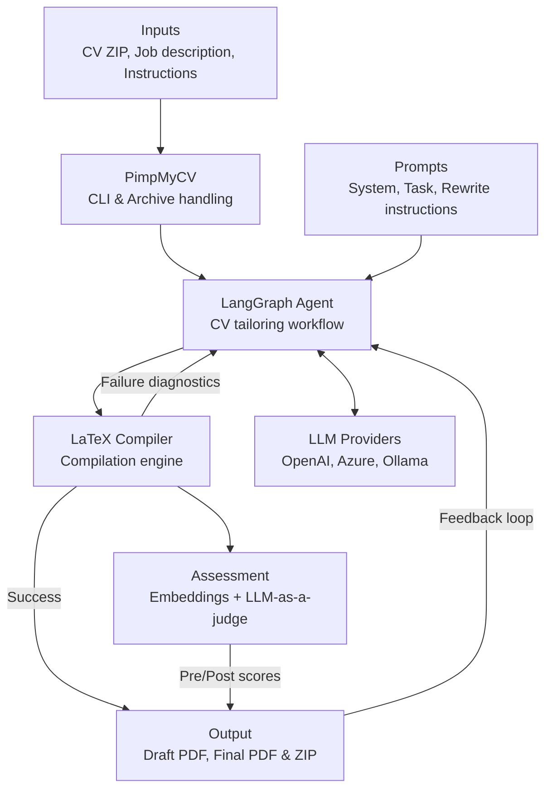

# PimpMyCV

[](https://www.python.org/)
[](https://opensource.org/licenses/MIT)
[](https://streamlit.io/)


## One CV project. A role-specific build for every application.

PimpMyCV turns each application into a controlled rewrite-and-build loop. Give
it your complete LaTeX project, a job description, and optional instructions.
The agent finds the strongest evidence already present in your CV, rewrites and
reorders the content for the role, and compiles the result. 

When the PDF builds, you stay in control: review the draft, request another
revision, or accept it. The system also provides pre and post-assessment scores
showing how well your CV matches the job description. Your template and support
files survive the process, your original ZIP stays untouched, and unsupported
achievements do not magically appear because a job ad asked nicely.

Use Ollama, OpenAI, or Azure OpenAI. Get back both the ready-to-send PDF and the
rewritten LaTeX project.

**Less keyword soup. Fewer broken braces. No late-night re-writting.**

## Install on Ubuntu

```bash
sudo apt update
sudo apt install -y python3-venv latexmk biber texlive-latex-base texlive-latex-extra

python3 -m venv .venv
source .venv/bin/activate
python -m pip install -e .
```

## Configure

Copy the example environment file:

```bash
cp .env.example .env
```

Add all provider settings to `.env`, including the provider, credentials,
endpoint, and model or Azure deployment. Fill in the variables for the provider
you use:

| Provider | `.env` variables |
| --- | --- |
| OpenAI | `PIMPMYCV_PROVIDER`, `OPENAI_API_KEY`, `OPENAI_BASE_URL`, `PIMPMYCV_MODEL` |
| Azure OpenAI | `PIMPMYCV_PROVIDER`, `AZURE_OPENAI_API_KEY`, `AZURE_OPENAI_ENDPOINT`, `AZURE_OPENAI_DEPLOYMENT`, `AZURE_OPENAI_API_VERSION` |
| Ollama | `PIMPMYCV_PROVIDER`, `OLLAMA_BASE_URL`, `OLLAMA_API_KEY`, `OLLAMA_MODEL` |

Optional assessment configuration (for CV-job matching scores):
- `EMBEDDING_PROVIDER`: `huggingface` or `azure`
- `HUGGINGFACE_MODEL`: HuggingFace embedding model name (default: `sentence-transformers/all-MiniLM-L6-v2`)
- `AZURE_EMBEDDING_DEPLOYMENT`: Azure OpenAI embedding deployment name

## Ollama setup

Default mode uses gemma4:26b via Ollama, make sure you have pre-downloaded the model. Also increase the context window for better results, ideally to 64K tokens.
```aiignore
sudo systemctl edit ollama

[Service]
Environment="OLLAMA_CONTEXT_LENGTH=65536"
```


```aiignore
sudo systemctl restart ollama
```

```bash
ollama pull gemma4:26b
```
Ollama must be running before using its provider:

```bash
ollama serve
```

## Inputs

- A ZIP containing the main `.tex` file and every required style, image, font,
  bibliography, and `\input` file
- A UTF-8 `.txt` job description
- An optional UTF-8 `.txt` or `.md` instructions file

If the ZIP contains multiple LaTeX documents, use `--main-tex` to select the
main file.

## Run
To execute the system with default params run the following:
```bash 
pimpmycv --cv examples/sample_cv.zip \
--job examples/job_description.txt \
--instructions examples/instructions.txt \
--output build
```
The provider and model are read from `.env`. After each successful draft,
review `build/draft_cv.pdf`, enter feedback to request another revision, or
press Enter to accept it. Use `--no-feedback` to accept the first compilable
draft.

Final files:

```text
build/tailored_cv.pdf
build/tailored_cv.zip
```

Use `--verbose` for progress messages, `--debug` for detailed logs and saved
attempts, and `pimpmycv --help` for all options.

### Browser GUI

Launch the local web interface:

```bash
pimpmycv-gui
```

The browser UI accepts the same CV ZIP, job description, provider, model, and
LaTeX engine settings as the CLI. Each successful draft appears in an embedded
PDF viewer. Accept it or enter feedback to request another revision; after
acceptance, download both `tailored_cv.pdf` and `tailored_cv.zip`. Credentials
can come from `.env` as before, or can be entered into the password field for
the current browser session. When Ollama is selected, the model dropdown offers
`gemma4:26b` and `gemma4:e4b`.

<video src="https://github.com/user-attachments/assets/2b7aab70-f6fd-4b6c-9983-8c69200699b7"
       controls
       width="800">
</video>

## Architecture

The agent is built using **LangGraph**, providing a declarative, stateful workflow for CV tailoring:



### LangGraph Agent Nodes

The agent uses a stateful graph with 5 specialized nodes:

- **generate_candidate**: Calls the LLM to produce a LaTeX CV candidate using tool calling or text extraction
- **compile_candidate**: Compiles the LaTeX candidate and returns the result
- **handle_compilation_success**: Processes successful compilation, requests user feedback if enabled
- **handle_compilation_failure**: Returns compilation diagnostics to the model for correction
- **handle_no_candidate**: Handles cases where the model produces no valid LaTeX

Conditional edges route the workflow based on compilation results, attempt limits, and user feedback.

The agent prompts are editable in `src/pimpmycv/prompts/`.

The CV, job description, and instructions are sent to the configured endpoint.
Review the generated CV and debug files before sharing or using them.
