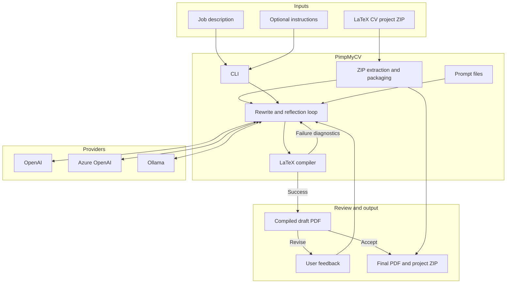

# PimpMyCV

[](https://www.python.org/)


PimpMyCV tailors a LaTeX CV to a job description, compiles it, and lets you
request revisions before accepting the final PDF. It supports OpenAI, Azure
OpenAI, and Ollama.

The original ZIP is not modified, its support files are preserved, and the
agent is instructed not to invent experience or credentials.

## Install on Ubuntu

```bash
sudo apt update
sudo apt install -y python3-venv latexmk biber texlive-latex-base texlive-latex-extra

python3 -m venv .venv
source .venv/bin/activate
python -m pip install -e .
```

## Configure

Copy the example environment file:

```bash
cp .env.example .env
```

Add all provider settings to `.env`, including the provider, credentials,
endpoint, and model or Azure deployment. Fill in the variables for the provider
you use:

| Provider | `.env` variables |
| --- | --- |
| OpenAI | `PIMPMYCV_PROVIDER`, `OPENAI_API_KEY`, `OPENAI_BASE_URL`, `PIMPMYCV_MODEL` |
| Azure OpenAI | `PIMPMYCV_PROVIDER`, `AZURE_OPENAI_API_KEY`, `AZURE_OPENAI_ENDPOINT`, `AZURE_OPENAI_DEPLOYMENT`, `AZURE_OPENAI_API_VERSION` |
| Ollama | `PIMPMYCV_PROVIDER`, `OLLAMA_BASE_URL`, `OLLAMA_API_KEY`, `OLLAMA_MODEL` |

Ollama must be running before using its provider:

```bash
ollama serve
```

## Inputs

- A ZIP containing the main `.tex` file and every required style, image, font,
  bibliography, and `\input` file
- A UTF-8 `.txt` job description
- An optional UTF-8 `.txt` or `.md` instructions file

If the ZIP contains multiple LaTeX documents, use `--main-tex` to select the
main file.

## Run

```bash
pimpmycv \
  --cv /path/to/cv.zip \
  --job /path/to/job.txt \
  --instructions /path/to/instructions.txt \
  --output build
```

The provider and model are read from `.env`. After each successful draft,
review `build/draft_cv.pdf`, enter feedback to request another revision, or
press Enter to accept it. Use `--no-feedback` to accept the first compilable
draft.

Final files:

```text
build/tailored_cv.pdf
build/tailored_cv.zip
```

Use `--verbose` for progress messages, `--debug` for detailed logs and saved
attempts, and `pimpmycv --help` for all options.

## Architecture



## Tests

```bash
pytest
pytest tests/test_latex_integration.py -q -rs
```

The agent prompts are editable in `src/pimpmycv/prompts/`.

The CV, job description, and instructions are sent to the configured endpoint.
Review the generated CV and debug files before sharing or using them.
